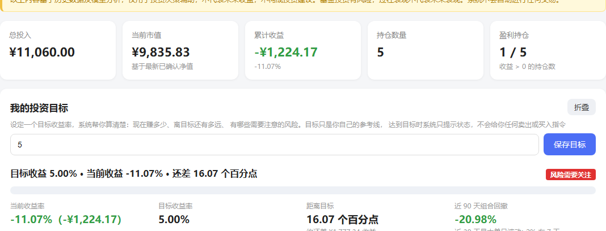
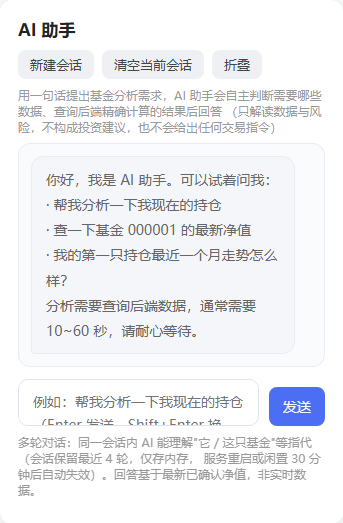
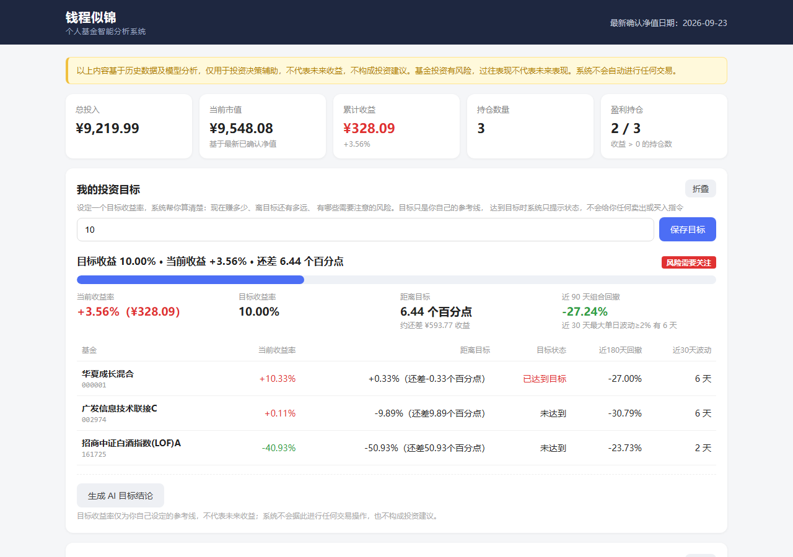
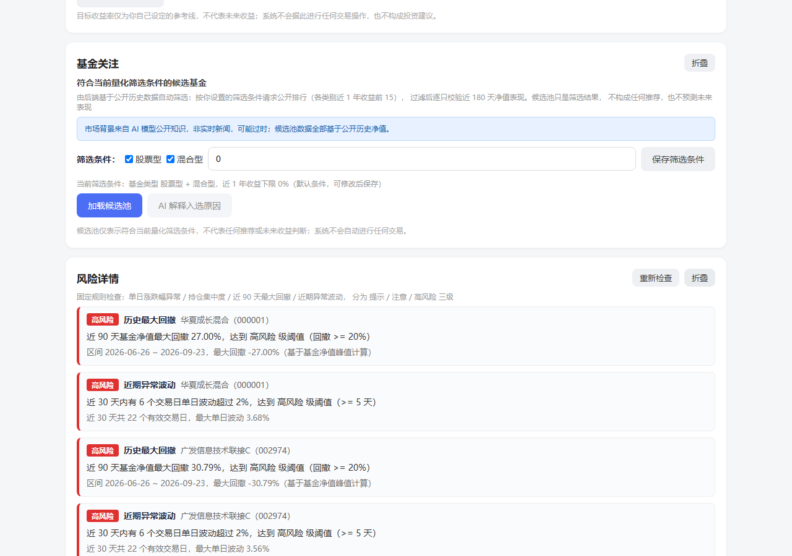
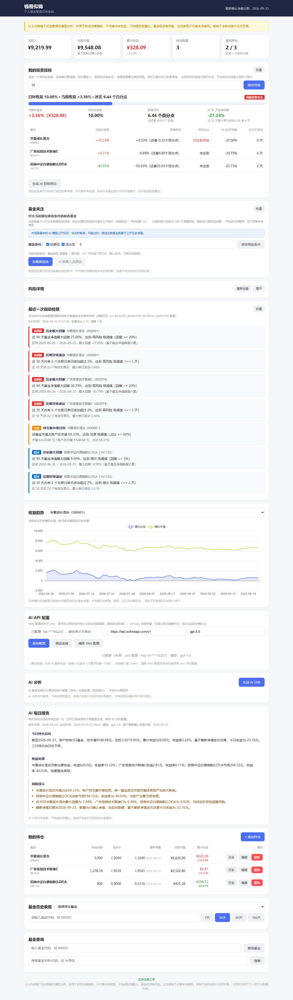
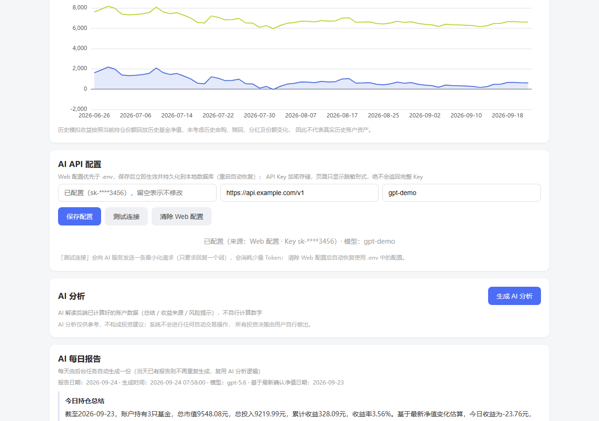
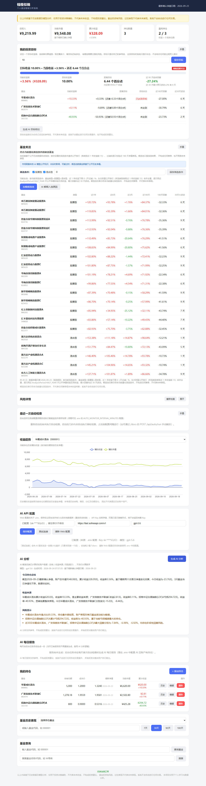

# 📊 钱程似锦（Qiancheng）

> 基于 Python + FastAPI + 基金数据 API + GPT 的个人基金智能监控与分析系统（内置 Tool Calling 智能体）

钱程似锦（Qiancheng） 是一个面向个人投资者的基金数据监控与 AI 分析项目。

项目通过基金数据接口获取基金净值、涨跌幅等公开市场数据，结合用户自行录入的持仓信息，自动计算账户收益、仓位变化和风险指标；并通过 OpenAI 兼容 API 接入 GPT，对账户数据进行分析和生成日报。

**v0.2.0 起内置 AI 助手（Agent）**：基于 OpenAI Tool Calling 的智能体，能自主判断需要哪些数据、调用后端查询工具、基于精确计算结果回答用户的自然语言提问，支持多轮对话与 SSE 流式输出。

> ⚠️ **免责声明**
>
> 本项目仅用于个人学习、数据分析和信息整理，不构成任何投资建议。
> AI 输出结果仅作为辅助信息，不保证收益，也不代替用户进行投资决策。
>
> 项目不会自动进行基金买卖操作。

---

## 🛠 核心技术亮点

* **Agent + Tool Calling**：AI 助手基于 OpenAI Tool Calling 自主规划数据查询——模型决定调用哪些只读工具（大盘行情 / 基金信息 / 历史净值 / 区间表现 / 持仓 / 账户汇总 / 持仓回放，共 7 个），工具直接复用后端 service 层（Decimal 计算与缓存自动生效），循环上限 6 轮防失控
* **多轮会话 + SSE 流式**：进程内轻量会话（每会话保留最近 4 轮问答，TTL 30 分钟），模型能理解"它 / 这只基金"等指代；对话经 SSE（`text/event-stream`）推送，工具执行状态实时可见、最终回复分块流出
* **红线安全优先**：最终回复先完整生成并通过预测性 / 推荐性表述检测（`FORBIDDEN_PREDICTIVE_PHRASES`），之后才允许流出——不为流式效果降低安全性；AI 全程禁止交易指令、禁止自行计算数字
* **精确金融计算**：所有金额 / 收益 / 市值计算使用 Python `Decimal` 并统一 `ROUND_HALF_UP` 舍入，杜绝浮点误差；前端不重算任何数字，全部以后端返回为准
* **异步架构**：FastAPI + httpx.AsyncClient 异步获取基金数据，数据源自动分页、失败重试与友好降级（数据源故障不伪造数据）
* **AI 安全接入**：兼容 OpenAI 接口协议；API Key 使用 Fernet 对称加密（密钥由本机 `FUND_PILOT_SECRET_KEY` 派生）后落库，页面 / 日志 / API 响应全程只出现脱敏 Key
* **自动化后台任务**：基于 asyncio 协程 + FastAPI lifespan 的定时任务（无需额外调度框架），自动执行智能监控并生成 AI 每日报告，异常隔离、单次失败不中断后续周期
* **固定规则风控**：四类检查规则（涨跌幅异常 / 持仓集中度 / 最大回撤 / 异常波动）全部显式写在代码中，按三级分级输出，AI 不参与风控计算
* **前端渲染防注入**：AI 输出先整体 HTML 转义再做有限 Markdown 转换（加粗 / 行内代码 / 代码块 / 列表），其余内容一律 `textContent` 渲染
* **完整测试**：208 项 pytest 覆盖（数据计算 / 基金 API / AI 分析与红线 / Agent 循环与会话 / SSE 流式 / 大盘行情 / 目标状态 / 候选池筛选 / 监控 / 自动化 / 配置安全），并有真实模型端到端验证脚本

---

## ✨ 项目目标

我希望通过这个项目实现一个属于自己的：

**「基金数据监控 + AI 分析助手」**

最终实现：

```text
基金数据
   ↓
Python 获取
   ↓
数据清洗
   ↓
数据库
   ↓
收益计算
   ↓
风险监控
   ↓
GPT AI 分析
   ↓
Web Dashboard
   ↓
每日基金报告
```

---

# 🚀 核心功能

## 1. 基金管理

支持添加、修改、删除基金。

记录：

* 基金名称
* 基金代码
* 持有份额
* 持仓成本
* 买入金额
* 当前市值

---

## 2. 基金数据获取

通过第三方基金数据 API 获取公开市场数据。

计划获取：

* 基金名称
* 基金代码
* 最新净值
* 单日涨跌幅
* 历史净值
* 净值日期
* 基金基本信息

> 数据接口会根据实际可用情况选择，不绑定某一个数据提供商。

> **当前状态（2026-09-22）**：已接入东方财富 / 天天基金公开接口（历史净值 + 基金搜索）。
> 注意：这些是**公开网页接口**而非官方开放 API，无 SLA 保证，结构可能变化；
> 原实时估值接口 fundgz.1234567.com.cn 已失效（返回 notfound），
> 系统会明确返回"估值不可用"状态，不使用任何假数据。

---

## 3. 自动计算收益

系统自动计算：

### 今日收益

```text
今日收益 =
持有份额 × 当日净值变化
```

### 当前市值

```text
当前市值 =
持有份额 × 最新净值
```

### 累计收益

```text
累计收益 =
当前市值 - 总投入金额
```

### 收益率

```text
收益率 =
累计收益 ÷ 总投入金额 × 100%
```

---

# 📈 4. 账户 Dashboard

首页展示：

```text
┌─────────────────────────────────────┐
│          钱程似锦（Qiancheng）               │
├─────────────────────────────────────┤
│                                     │
│ 总资产                              │
│ ¥18,632.51                          │
│                                     │
│ 今日收益                            │
│ +¥286.31    +1.56%                 │
│                                     │
│ 累计收益                            │
│ +¥1,632.51  +9.60%                 │
│                                     │
├─────────────────────────────────────┤
│ 我的基金                            │
│                                     │
│ 半导体基金       ¥5,000    +2.31%  │
│ 沪深300          ¥4,000    +0.83%  │
│ 新能源基金       ¥3,000    -1.12%  │
│ 军工基金         ¥2,500    +1.43%  │
│                                     │
├─────────────────────────────────────┤
│ 📊 收益曲线                         │
│                                     │
│          ╭────╮                     │
│      ╭───╯    ╰────╮                │
│ ─────╯              ╰──             │
│                                     │
└─────────────────────────────────────┘
```

前端计划使用 ECharts 绘制：

* 收益曲线
* 基金涨跌
* 仓位比例
* 历史收益
* 基金对账户收益的贡献

---

# 🤖 5. GPT AI 分析

这是本项目的核心功能之一。

系统不会让 GPT 直接控制账户，也不会自动进行交易。

Python 首先整理账户数据：

```json
{
  "total_asset": 18632.51,
  "today_profit": 286.31,
  "total_profit": 1632.51,
  "funds": [
    {
      "name": "半导体基金",
      "code": "000001",
      "market_value": 5000,
      "today_change": 2.31,
      "profit_rate": 8.42
    }
  ]
}
```

然后发送给 GPT。

GPT 负责：

* 总结今日账户变化
* 分析收益来源
* 分析基金之间的关联
* 分析仓位集中度
* 总结近期变化
* 识别需要关注的异常情况
* 生成每日账户报告
* 根据数据提出需要进一步关注的问题

---

# 🔌 GPT API

项目使用 **OpenAI 兼容 API**。

因此可以根据实际情况使用：

```text
OpenAI 官方 API
```

或者：

```text
第三方 OpenAI 兼容中转 API
```

程序通过：

```python
from openai import OpenAI

client = OpenAI(
    api_key="YOUR_API_KEY",
    base_url="YOUR_BASE_URL"
)
```

调用模型。

具体模型名称和 API 地址通过环境变量配置。

---

# 🔐 API Key 安全

**严禁把 API Key 直接写入 GitHub。**

错误：

```python
API_KEY = "sk-xxxxxxxxxxxxxxxx"
```

正确：

```text
.env
```

例如：

```env
AI_API_KEY=your_api_key
AI_BASE_URL=https://your-api-provider/v1
AI_MODEL=your-model-name
```

然后通过 Python 读取：

```python
import os

api_key = os.getenv("AI_API_KEY")
base_url = os.getenv("AI_BASE_URL")
model = os.getenv("AI_MODEL")
```

`.gitignore`：

```gitignore
.env
__pycache__/
*.pyc
.venv/
venv/
.idea/
```

**Phase 9 起支持在 Dashboard「AI API 配置」面板直接填写配置（优先于 .env）：**

* 保存前必须配置环境变量 `FUND_PILOT_SECRET_KEY`（本机随机生成，禁止硬编码/提交），
  未配置时后端拒绝保存并明确提示
* API Key 用 `FUND_PILOT_SECRET_KEY` 派生的 Fernet 密钥加密后存入本地 SQLite
  （`web_ai_configs` 表），数据库 / 日志 / API 响应 / 页面均不出现明文
* 页面只显示脱敏 Key（前 3 位 + `****` + 后 4 位）；清除 Web 配置后自动恢复 .env
* 「测试连接」发送最小化请求（max_tokens=10），会消耗少量 Token

---

# ⚠️ AI 决策原则

本项目不会让 GPT 直接执行买卖操作。

系统采用：

```text
数据
 ↓
Python 精确计算
 ↓
规则检测
 ↓
GPT 分析
 ↓
用户查看
 ↓
用户自行决策
```

而不是：

```text
GPT
 ↓
自动买入
 ↓
自动卖出
```

---

# 🚨 6. 智能监控

Python 负责执行确定性的规则，阈值作为常量明确写在 `monitor_service.py` 代码顶部。
AI 不参与任何数值计算（数值全部由后端 Decimal 精确计算），只负责解读（Phase 6）。

当前实现的四类检查与三级分级（提示 / 注意 / 高风险）：

| 检查项 | 数据口径 | 提示 | 注意 | 高风险 |
|---|---|---|---|---|
| 单日涨跌幅异常 | 最新交易日日涨跌幅（绝对值） | ≥ 2% | ≥ 3% | ≥ 5% |
| 持仓集中度过高 | 单只基金市值 ÷ 账户总市值 | ≥ 40% | ≥ 60% | ≥ 80% |
| 历史最大回撤 | 单只基金近 90 天净值峰值回撤 | ≥ 5% | ≥ 10% | ≥ 20% |
| 近期异常波动 | 近 30 天内 \|日涨跌幅\| ≥ 2% 的交易日数 | ≥ 2 天 | ≥ 3 天 | ≥ 5 天 |

接口：`GET /api/monitor`，一次检查返回全部提醒，按 高风险 → 注意 → 提示 排序。

* 每条提醒包含：类型、等级、基金名称/代码、触发原因、具体数据
* 无异常时返回"当前未发现明显异常"
* 数据不足或单只基金接口异常时如实说明（data_issues 字段），不伪造数据
* 定时任务每轮自动执行本检查并保存快照（见下方"自动化"章节）

本项目不会让 GPT 直接执行买卖操作，监控提醒也不构成任何买卖建议。

---

# 🧠 7. 自动化（定时任务 + AI 每日报告）

Phase 8 实现：后台定时任务在 FastAPI 生命周期内启动 / 停止（asyncio 协程，不阻塞请求处理），
每轮自动执行"智能监控 → 保存快照 → 生成 AI 每日报告"。

## 定时机制

* 定时循环基于 asyncio 实现（未引入第三方调度库），应用启动时创建、关闭时取消
* 采用"先等待一个间隔再执行第一轮"的方式，避免服务启动瞬间请求外部接口
* 间隔与开关全部是 `.env` 配置项（不硬编码）：

```env
AUTO_TASK_ENABLED=true                # 是否启用后台任务
AUTO_MONITOR_INTERVAL_MINUTES=60      # 检查间隔（分钟），开发环境勿设过短
AUTO_DAILY_REPORT_ENABLED=true        # 是否自动生成 AI 每日报告
```

## 每轮自动检查做什么

1. **智能监控**：执行与 `GET /api/monitor` 相同的四类规则检查
2. **保存快照**：写入 `monitor_snapshots` 表（执行时间、检查持仓数、提醒数量、提醒内容、数据问题）
3. **AI 每日报告**：复用 Phase 6 的 AI 分析逻辑（同样的数据组装 / 模型调用 / JSON 解析），
   写入 `daily_reports` 表（报告日期、生成时间、模型、内容、免责声明），**每天最多一份**，
   当天已有报告时自动跳过，避免频繁调用 AI

## 失败隔离

AI、数据源、落库任一环节失败都只记录日志与错误说明，不会让定时任务崩溃，下一轮继续；
监控整体失败时也会保存一份"失败记录"快照（data_issues 注明原因），绝不伪造数据。

## 相关接口

| 接口 | 说明 |
|---|---|
| `GET /api/auto/latest` | 最近一次自动检查快照（未执行过时返回 null） |
| `GET /api/auto/daily-report` | 最新 AI 每日报告（还没有时返回 null） |
| `POST /api/auto/run` | 手动触发一轮自动检查（与定时任务同一逻辑，便于验证） |

Dashboard 新增「最近一次自动检查」与「AI 每日报告」两个只读面板，刷新页面即可看到最新结果。

本项目不会让 GPT 直接执行买卖操作，日报与提醒均不构成任何投资建议。

---

# 🎯 8. 投资目标与目标收益分析（Phase 12/13）

围绕用户自己设定的目标收益率，让普通用户一眼看懂
"我现在赚多少、离目标还有多少、当前应该重点关注什么"：

* **投资目标设置**：目标收益率可保存 / 修改（本地数据库持久化，重启不丢）
* **目标收益分析**：当前收益率 / 目标收益率 / 距离目标（百分点）/ 进度条（后端 Decimal 计算）
  + 近 90 天组合回撤 / 近 30 天大波动天数 + 分持仓明细
* **5 状态展示**（互斥单选，阈值常量写在代码中）：
  未设置 → 风险需要关注（90 天回撤 ≥10% 或 30 天大波动 ≥3 天）→ 已达到目标（进度 ≥100%）
  → 接近目标（进度 ≥50%）→ 距离目标较远（<50%）
* **AI 目标结论**：只输出三种状态之一（接近目标 / 已达到目标 / 风险需要关注），
  只解释数据与风险因素，绝不给出买卖 / 止盈指令；达到目标仅显示状态，不生成卖出结论

> 目标收益率只是你自己设定的参考线，不等于止盈条件；系统不会据此进行任何交易。

---

# 🔍 9. 基金关注（候选池，Phase 12/13）

基于公开历史数据的量化筛选（明确不是推荐）：

* **筛选条件**：基金类型勾选（股票型 / 混合型）+ 近 1 年收益下限（%），保存在本地数据库；
  页面明确展示当前生效的筛选规则
* **筛选管线**：东方财富公开排行（所选类别各取近 1 年收益前 15）合并去重 →
  按条件过滤 → 逐只用近 180 天公开净值校验区间收益 / 最大回撤 / 30 天波动，
  历史不足的剔除并如实说明（不伪造数据、不从最差补位）
* **AI 解读**：只解释每只基金"为什么符合当前筛选条件"，全程禁止
  "推荐购买 / 值得买 / 最优 / 必涨 / 一定盈利"等表述；
  禁止根据历史数据推断未来上涨、盈利概率或收益结果（解析层强制拦截）
* 分析期间显示明确的 Loading 提示（"正在分析 X 只候选基金，请稍候"）

接口：`GET /api/funds/candidates`、`GET/PUT /api/candidates/filter`、
`POST /api/ai/candidate-analysis`。

> 候选池仅表示符合当前量化筛选条件，不构成任何推荐，也不预测未来表现。

---

# 🤖 10. AI 助手（Agent + Tool Calling，Phase 15-18）

Dashboard 内置「AI 助手」对话面板：用户用自然语言提出基金分析需求，
Agent 自主判断需要哪些数据、调用对应工具查询后端精确计算的结果，然后综合回答。

## Agent 循环（Tool Calling 流程）

```text
用户提问（如"帮我分析一下现在的持仓"）
   ↓
Agent 判断需要哪些数据
   ↓ 调用工具（可多轮、可一次多个）
后端 Service 执行（Decimal 精确计算 + 数据源缓存）
   ↓ 结果以 role="tool" 回填上下文
Agent 继续判断：数据够不够
   ↓
生成最终回复 → 红线检测（预测性/推荐性表述）
   ↓ 通过
SSE 分块推送给前端（含工具调用链徽章）
```

* 循环上限 6 轮，超限返回 502（防模型反复调工具失控）
* 工具执行器永不抛异常：参数非法 / 基金不存在 / 数据源不可用都转为
  `{"error": ...}` 回给模型自行纠正，单个工具失败不打断对话
* 参数在服务端二次校验（JSON Schema 只是给模型的提示）

## 7 个只读工具（全部复用现有 Service，零重复实现）

| 工具 | 数据 | 后端实现 |
|---|---|---|
| get_market_index | 大盘行情（上证 / 深证成指 / 创业板指：点位 / 涨跌 / 更新时间） | market_service.get_market_indexes（腾讯公开行情接口） |
| get_fund_detail | 基金名称 / 类型 / 最新净值 | fund_service.get_fund_detail |
| get_fund_history | 历史净值（分页，最新在前） | fund_service.get_fund_history |
| get_fund_performance | 区间收益 / 最大回撤（7/30/90/180 天） | fund_service.get_fund_performance |
| get_holdings | 全部持仓（市值 / 收益 / 占比数据） | portfolio_service.list_holdings |
| get_portfolio_summary | 账户总投入 / 市值 / 累计收益 | portfolio_service.get_summary |
| get_holding_history | 持仓历史模拟市值回放 | portfolio_service.get_holding_simulated_history |

全部为只读查询，无任何交易操作；数字全部来自后端 Decimal 计算结果，
prompt 明确禁止模型自行计算或编造。

## 多轮会话机制（Phase 18）

* 轻量进程内存会话（`agent_session`）：每会话只保留**最近 4 轮问答**
  （8 条 user/assistant 消息），工具中间产物不入历史，控制上下文长度
* TTL 30 分钟过期、会话总数上限 200；服务重启即清空（页面有明示）
* 客户端首次请求获得 `session_id`，之后回传即可延续上下文——
  实测模型能正确理解"它 / 这只基金"等指代（真实 E2E 中第二轮仅说
  "它最近90天表现怎么样？"，模型自主调用 `get_fund_performance(000001, 90)`）
* 只有整轮成功（含红线检测通过）的问答才写入历史

## SSE 流式机制（Phase 18）

* 接口：`POST /api/agent/chat/stream`（`text/event-stream`）
* 事件：`session`（会话 id）→ `status`（思考中 / 正在查询某工具 / 生成回复中）
  → `tool_done` → `delta`（回复增量）→ `done`（完整结果）｜失败时 `error`
* 工具执行阶段状态为**真实实时推送**；最终回复**先完整生成并通过红线检测、
  之后才分块流出**——不存在"先流出违规文本再撤销"，安全性与流式体验兼得
* 前端用 `fetch` + `ReadableStream` 消费（POST 请求不适用 EventSource），
  增量文本经"先转义再渲染"的安全 Markdown 管线逐步上屏

## 安全与红线策略（长期约束）

* **禁交易指令**：prompt 层 + 解析层双重约束，AI 不输出买入 / 卖出 / 加仓等任何指令
* **禁预测性表述**：`FORBIDDEN_PREDICTIVE_PHRASES`（"有望上涨 / 盈利概率 / 值得买"等）
  在解析层强制检查，命中即整次拒绝（HTTP 502 / 流式 `error` 事件），不做片段丢弃
* **数字不可编造**：所有数字只能来自工具返回的后端计算结果
* **注入防护**：前端先 HTML 转义再做有限 Markdown 转换，其余一律 `textContent`
* 接口：`POST /api/agent/chat`（一次性 JSON）、`POST /api/agent/chat/stream`（SSE）

---

# 🏗️ 项目技术栈

## 后端

```text
Python 3.11+
FastAPI
Uvicorn
Pydantic
httpx
OpenAI SDK
```

---

## 数据库

第一阶段（当前）：

```text
SQLite（app/database/，SQLAlchemy 2.x，数据文件 data/fundpilot.db）
```

后续：

```text
MySQL
```

---

## 前端

第一阶段：

```text
HTML
CSS
JavaScript
ECharts
```

后续根据项目规模考虑：

```text
Vue 3
```

---

## AI

```text
OpenAI Compatible API
```

支持配置：

```text
API Key
Base URL
Model
```

因此不会把 AI 服务商写死。

---

# 📁 项目结构

```text
Qiancheng/
│
├── app/
│   ├── main.py                    # FastAPI 入口（lifespan 自动化任务 + 路由注册）
│   │
│   ├── agent/                     # Agent 工具层（Phase 15）
│   │   └── tools.py               # 6 个只读 Tool 的 Schema 定义与执行器
│   │
│   ├── api/                       # 路由层（参数校验 + 异常→HTTP 状态码）
│   │   ├── fund.py                # 基金查询 / 历史 / 表现 / 候选池
│   │   ├── portfolio.py           # 持仓 CRUD / 账户汇总 / 模拟回放
│   │   ├── goal.py                # 投资目标与进度
│   │   ├── candidate.py           # 候选池筛选条件
│   │   ├── ai.py                  # AI 分析 / 目标结论 / 候选池解读 / Web 配置
│   │   ├── agent.py               # AI 助手对话（JSON + SSE 流式）
│   │   ├── monitor.py             # 风险检查
│   │   └── automation.py          # 自动检查 / AI 日报
│   │
│   ├── services/                  # 业务层
│   │   ├── fund_service.py        # 基金数据（缓存 + 区间表现计算）
│   │   ├── portfolio_service.py   # 持仓 / 收益计算（Decimal）
│   │   ├── fund_data_source.py    # 东方财富公开数据源（自动翻页 / 异常转换）
│   │   ├── ai_service.py          # 一次性 AI 分析（分析 / 目标结论 / 候选池解读）
│   │   ├── agent_service.py       # Agent 循环（事件生成器，非流式为其包装）
│   │   ├── agent_session.py       # Agent 多轮会话（内存，TTL + 条数上限）
│   │   ├── goal_service.py        # 目标进度与 5 状态分类
│   │   ├── candidate_service.py   # 候选池筛选管线
│   │   ├── monitor_service.py     # 固定规则风险检查
│   │   ├── market_service.py      # 大盘行情（腾讯公开行情接口，Phase 20）
│   │   ├── automation_service.py  # 后台定时任务
│   │   └── web_config_service.py  # Web AI 配置（Fernet 加密）
│   │
│   ├── models/                    # Pydantic 模型（fund / portfolio / goal / agent / ...）
│   ├── database/                  # SQLAlchemy + SQLite
│   └── utils/calculator.py        # Decimal 金融计算（全项目唯一数值入口）
│
├── frontend/
│   ├── index.html
│   ├── css/style.css
│   └── js/
│       ├── api.js                 # fetch 封装 + 统一错误文案
│       ├── charts.js              # ECharts 渲染
│       ├── dashboard.js           # 业务逻辑
│       ├── agent-chat.js          # AI 助手对话（SSE 消费 + 安全 Markdown）
│       └── app.js                 # 全局工具函数 + 事件绑定
│
├── data/                          # SQLite 数据文件（不入库 git）
├── docs/
│   ├── screenshots/               # 项目截图（脱敏演示数据）
│   └── dev-notes/                 # 历史开发笔记
├── tests/                         # pytest（208 项）+ manual 真实网络验证脚本
├── .env.example
├── .gitignore
├── requirements.txt
└── README.md
```

---

# 🔄 系统工作流程

```text
                    ┌──────────────┐
                    │ 基金数据 API  │
                    └──────┬───────┘
                           ↓
                    ┌──────────────┐
                    │ Python 获取   │
                    └──────┬───────┘
                           ↓
                    ┌──────────────┐
                    │ 数据处理      │
                    └──────┬───────┘
                           ↓
                    ┌──────────────┐
                    │ SQLite/MySQL │
                    └──────┬───────┘
                           ↓
                ┌──────────┴──────────┐
                ↓                     ↓
         收益计算/规则             GPT API
                ↓                     ↓
                └──────────┬──────────┘
                           ↓
                    ┌──────────────┐
                    │ FastAPI      │
                    └──────┬───────┘
                           ↓
                    ┌──────────────┐
                    │ Web Dashboard│
                    └──────────────┘
```

---

# 🛠️ 开发路线

项目不会一次性写完。

采用逐步开发方式。

## Phase 1：项目基础

目标：

```text
Python
FastAPI
HTML
```

实现：

* 启动 Web 服务
* 首页
* API 测试
* 基础项目结构

---

## Phase 2：基金数据 ✅ 已完成（2026-09-22）

实现：

* 基金搜索（关键词 / 代码）
* 基金基本信息
* 最新净值（来自历史净值接口第 1 条）
* 历史净值（分页）
* 涨跌幅（历史日增长率）
* ~~实时估值~~（fundgz 接口已失效，明确返回不可用状态）

---

## Phase 3：我的持仓 ✅ 已完成（2026-09-22）

实现：

* 添加基金（自动获取基金名称，重复添加返回 409）
* 修改基金（份额 / 成本）
* 删除基金
* 持有份额 / 持仓成本
* 当前市值（份额 × 最新已确认净值）
* 累计收益 / 收益率（Decimal 精确计算）
* 今日收益估算（基于最新两个交易日净值变化，字段名 latest_nav_change）

---

## Phase 4：基金历史表现分析 ✅ 已完成（2026-09-22）

实现：

* 基金区间历史表现：近 7 / 30 / 90 / 180 天区间收益率 + 最大回撤（Decimal 计算）
* 净值走势数据点（按时间正序，供 ECharts 画图）
* 持仓历史模拟市值：按当前份额回放历史净值，逐点计算模拟市值与模拟收益
* 前端 ECharts 图表：净值走势折线图、模拟市值/模拟收益双线图（CDN 失败自动降级为文字提示）
* 口径声明（重要）：历史模拟市值 ≠ 真实历史账户资产，页面与接口文档均明确标注

⚠️ 口径说明：历史模拟市值按照当前持仓份额回放历史基金净值，未考虑历史申购、
赎回、分红及份额变化，因此不代表真实历史账户资产。

技术备注（2026-09-22 实测）：

* 东财 lsjz 接口带 startDate/endDate 参数时，每页固定只返回 20 条
  （pageSize 传更大值无效），数据源层已实现自动翻页（180 天约 7 页）
* period 参数用 int 枚举（AnalysisPeriod）校验：Pydantic v2 的 Literal[int]
  不会转换查询字符串导致合法值也报 422，int 枚举可自动转换且非法值仍返回 422

---

## Phase 5：专业 Dashboard ✅ 已完成（2026-09-22）

实现：

* 首页升级为 Dashboard：顶部导航 → 账户总览 → 收益趋势 → 我的持仓 → 基金历史表现 → 基金查询（信息层级：先看钱 → 收益 → 持仓 → 历史 → 最后深入查基金）
* 顶部导航：品牌标识 + 最新确认净值日期（不使用"实时"字样，估值数据源已失效）
* 账户总览 5 卡片：总投入 / 当前市值 / 累计收益(+收益率) / 持仓数量 / 盈利持仓数
* 收益趋势：单只持仓历史模拟收益折线图（按当前份额回放近 90 天净值），下拉切换持仓基金，附口径免责声明
* 我的持仓表格：基金名称(后端获取)/代码/份额/成本价/最新净值/市值/累计收益/收益率 + 历史/编辑/删除操作
* 添加/编辑持仓改为 Modal 弹窗（编辑时基金代码禁改，换基金 = 删除后重新添加）；删除带确认弹窗
* 基金历史表现：下拉选持仓或手输代码 + 7/30/90/180 天区间按钮组，区间收益率/最大回撤/起始净值/最新净值 + 净值走势图
* 前端代码拆分：api.js（fetch 封装+统一错误文案）/ charts.js（ECharts 实例复用+resize）/ dashboard.js（业务逻辑）/ app.js（工具函数+事件绑定）
* 空状态引导（无持仓时不显示一排 ¥0，显示"添加持仓"引导）；toast 轻提示；涨红跌绿全站统一
* 响应式：桌面（1100px+）/ 平板 / 手机（表格自动转卡片式，无横向滚动）

⚠️ 口径说明：历史模拟收益按照当前持仓份额回放历史基金净值，未考虑历史申购、
赎回、分红及份额变化，因此不代表真实历史账户资产。

技术备注：

* 本阶段未新增后端 API，全部复用 Phase 2-4 已有接口
* ECharts 通过 CDN 引入，加载失败时图表区降级为文字提示，不影响其他功能
* 所有请求均有 loading 状态，错误统一转为用户可读文案（不暴露 HTTP 状态码）

---

## Phase 6：GPT AI 分析 ✅ 已完成（2026-09-22）

接入：

```text
OpenAI Compatible API
```

实现：

* `GET /api/ai/status`：AI 配置状态检查（只返回 configured / model / base_url，绝不返回 API Key）
* `POST /api/ai/analysis`：把后端已精确计算好的账户汇总、持仓收益、近 30 天基金表现等结构化数据发送给模型
* AI 返回三块内容：今日持仓总结 / 收益来源 / 风险提示（约定 JSON 输出，后端解析后结构化返回）
* AI 红线：只解读后端提供的数据，禁止自行计算净值或收益，禁止给出任何交易指令
* Dashboard「AI 分析」面板：按钮触发 / loading 动画 / 结果展示（纯文本渲染防注入）/ 面板内错误提示 / 未配置时禁用按钮并提示
* 免责声明固定展示：AI 分析仅供参考，不构成投资建议；系统不会进行任何自动交易操作
* 安全：API Key 只从 .env 读取（.env 被 .gitignore 屏蔽），prompt 与响应中均不包含密钥

> 说明：AI 每日报告（定时生成、保存历史）规划在 Phase 8 自动化阶段实现。

---

## Phase 7：智能监控 ✅ 已完成（2026-09-22）

实现：

* `GET /api/monitor`：四类固定规则检查——单日涨跌幅异常 / 持仓集中度过高 / 近 90 天最大回撤 / 近期异常波动
* 三级分级（提示 / 注意 / 高风险），阈值作为常量明确写入 `monitor_service.py`，改规则 = 改常量
* 每条提醒包含：类型、等级、基金名称/代码、触发原因、具体数据；返回前按 高风险 → 注意 → 提示 排序
* 数值全部由后端 Decimal 计算（复用 calculator 与现有净值数据），AI 不参与数值计算
* Dashboard「智能监控」面板（账户总览之下）：页面加载自动检查 + "重新检查"按钮，等级徽章红/橙/蓝区分，纯文本渲染防注入
* 无异常显示"当前未发现明显异常"；数据不足或单只基金接口异常时在面板内如实说明（不伪造数据）
* 不做自动交易，不给出买卖建议（面板固定免责声明）

技术备注：

* 波动统计窗口内有效日涨跌幅样本 < 5 个、或近 90 天有效净值点 < 3 个时，对应检查跳过并写入 data_issues
* 历史最大回撤当前为"单只基金近 90 天"口径（复用 Phase 4 计算器）；账户级聚合回撤留待后续阶段
* 定时自动监控与 GPT 解读监控事件整合在 Phase 8

---

## Phase 8：自动化 ✅ 已完成（2026-09-23）

实现：

* 后台定时任务（asyncio 协程，FastAPI lifespan 启动 / 停止，不阻塞主线程、未引入新依赖）
* 每轮执行：智能监控（与 `GET /api/monitor` 同逻辑）→ 快照落库（`monitor_snapshots` 表）→
  AI 每日报告（复用 Phase 6 分析逻辑，落库 `daily_reports` 表，每天最多一份）
* 失败隔离：AI / 数据源 / 落库失败只记录日志与 errors，任务不崩溃、下一轮继续；
  监控整体失败时保存"失败记录"快照，不伪造数据
* 配置化：`AUTO_TASK_ENABLED` / `AUTO_MONITOR_INTERVAL_MINUTES`（默认 60，最小 1）/
  `AUTO_DAILY_REPORT_ENABLED`，均为 `.env` 配置项
* 新接口：`GET /api/auto/latest`、`GET /api/auto/daily-report`、`POST /api/auto/run`（手动触发）
* Dashboard 新增「最近一次自动检查」「AI 每日报告」面板（只读、纯文本渲染、免责声明固定展示）
* 不做自动交易，不产生买卖指令

技术备注：

* 首轮检查在服务启动后约 5 秒即执行一次（Phase 9 优化，原为等一个完整间隔），之后按配置间隔
  循环；首轮在循环协程内执行，不会与定时循环重复；需要立即验证可用 `POST /api/auto/run`
* AI 日报"每天一份"由 `daily_reports.report_date` 唯一约束 + 生成前查询共同保证，即使手动
  多次触发也不会重复调用模型
* 测试 12 个（快照/日报 API、失败隔离、配置解析、生命周期），全量 pytest 108 passed

---

## Phase 9：Web AI API 配置 + 安全本地持久化 ✅ 已完成（2026-09-23）

实现：

* Dashboard「AI API 配置」面板：API Key / Base URL / Model 三项 + 保存 / 测试连接 / 清除按钮
* Web 配置优先于 .env（字段级回退：Web 未填的字段回落 .env）；清除后完全恢复 .env
* Key 加密存储：密钥从 `FUND_PILOT_SECRET_KEY` 环境变量 sha256 派生 Fernet 密钥
  （禁止硬编码），未配置该变量时禁止保存（后端 400 明确提示 + 前端警告条）
* Key 绝不泄露：数据库存密文、日志不输出、API 响应与页面只显示脱敏形式
  （前 3 位 + `****` + 后 4 位），测试连接的错误信息也先抹去 Key 再返回
* 持久化：配置存 `web_ai_configs` 表（单行 upsert），服务重启后自动恢复生效
* 「测试连接」：最小化请求（只要求回复 OK，max_tokens=10），消耗少量 Token
* 「智能监控」「最近一次自动检查」面板增加折叠 / 展开按钮

新接口（挂 /api/ai 前缀）：

* `GET /api/ai/config` 生效配置状态（来源 / 脱敏 Key / secret_key_ready）
* `PUT /api/ai/config` 保存（Key 加密）
* `DELETE /api/ai/config` 清除（回退 .env）
* `POST /api/ai/config/test` 测试连接

技术备注：

* 依赖新增 `cryptography>=42.0.0`（Fernet 对称加密）
* 兼容性：`ai_service.run_analysis` / `_call_model` 对外签名不变，Phase 6/7/8 全部测试原样通过
* Phase 8 优化同批落地：首轮自动检查启动后约 5 秒执行（`FIRST_RUN_DELAY_SECONDS`），
  测试侧新增 `tests/conftest.py` 默认禁用后台任务，避免测试期间后台轮次写入真实库
* 测试 10 个（禁保存 / 加密落库 / 脱敏 / 优先级 / 清除回退 / 重启恢复 / 测试连接×3 / 首轮执行），
  全量 pytest 118 passed

---

## Phase 10-11：工程化 + 最终产品体验 ✅ 已完成（2026-09-23）

* 项目目录清理、`.gitignore` 完善、`.env.example` 占位符化（无真实 Key）
* 新用户首次启动流程验证（临时目录 + 临时库）
* 名称统一为「钱程似锦 Qiancheng」（曾用名 FundPilot AI 仅存在于历史记录与数据库文件名）
* UI / 文案 / 响应式（桌面 1280px + 手机 375px）一致性检查与修复
* 脱敏演示数据截图（docs/screenshots/），README 补充截图展示与核心技术亮点

---

## Phase 12：投资决策辅助 ✅ 已完成（2026-09-23）

* 投资目标设置（可修改、持久化）+ 目标收益分析（当前收益 / 距离目标 / 进度条 / 回撤 / 波动）
* AI 目标结论仅三种状态（接近目标 / 已达到目标 / 风险需要关注），禁止交易指令
* 基金关注候选池（公开排行 + 180 天净值校验），定位为「符合量化筛选条件」而非推荐
* 原「智能监控」升级为「风险详情」面板，默认折叠弱化
* 全局免责声明横幅置顶；AI 输出解析层强制拦截预测性 / 推荐性表述

---

## Phase 13：候选池增强 + AI 体验优化 ✅ 已完成（2026-09-23）

* 候选池筛选条件（基金类型勾选 + 近 1 年收益下限，存库持久化，页面展示当前规则）
* 过滤后不足数量如实返回、不补位；规则文案按用户条件动态生成
* AI 候选池解读 Loading 优化（"正在分析 X 只候选基金，请稍候"）
* 目标分析 5 状态（未设置 / 距离目标较远 / 接近目标 / 已达到目标 / 风险需要关注，
  风险优先，阈值常量写入代码），全量 pytest 164 passed

---

## Phase 14：v1.0 最终封版 ✅ 已完成（2026-09-24）

* 全仓库名称 / 安全 / 截图 / 文档终检；git init 完成，发布前检查全过
* README 更新（投资目标 / 基金关注章节 + 7 张脱敏截图 + 核心技术亮点）

---

## Phase 15：Agent + Tool Calling 基础架构 ✅ 已完成（2026-09-24）

* AI 助手 Agent 循环：模型自主决定调用哪些工具、循环执行直至给出最终回复
  （上限 6 轮），`POST /api/agent/chat`
* 6 个只读 Tool（`app/agent/tools.py`）全部复用现有 Service，零业务逻辑重复
* 工具执行器永不抛异常：参数非法 / 基金不存在 / 数据源不可用转 error 回给模型自纠
* 红线：最终回复命中预测性 / 推荐性表述 → 整次拒绝（502），不做片段丢弃
* pytest 179 passed（+15 Agent 用例）

---

## Phase 16：Agent 实战验收与稳定性增强 ✅ 已完成（2026-09-24）

* 真实 gpt-5.6 端到端 6 场景验收全过（无工具 / 单工具 / 多工具链 / 参数自纠 /
  工具异常转告 / 诱导预测干净拒绝），数据库全程只读
* 11 个边界用例（红线位置钉死 / 空回复 / 超长消息 / 未知工具 / 参数异常 /
  执行器异常 / 分页边界 / 数据源故障转告 / 重复调用由轮数上限兜底）
* 修复：区间常量统一为 AnalysisPeriod 枚举单一来源；pytest 190 passed

---

## Phase 17：前端 AI 助手对话面板 ✅ 已完成（2026-09-24）

* Dashboard「AI 助手」面板：消息气泡 / Enter 发送 / 安全 Markdown 渲染 /
  工具调用链中文徽章 / 加载计时 / 错误与免责声明展示 / 移动端适配
* 浏览器验收 15/15（真实 AI 发送端到端）；pytest 190 passed

---

## Phase 18：多轮对话 + SSE 流式输出 ✅ 已完成（2026-09-24）

* 轻量内存会话（每会话最近 4 轮 / TTL 30 分钟 / 无效 id 静默新建），
  模型可理解"它"等指代（真实 E2E：第二轮仅说"它最近90天怎么样？"，
  模型自主调用 `get_fund_performance(000001, 90)`）
* `POST /api/agent/chat/stream`（SSE）：工具状态实时推送；最终回复
  先完整生成并通过红线检测、之后才分块流出（安全优先）
* 前端流式渲染 + 新建会话 / 清空当前会话；pytest 200 passed；
  真实多轮流式 E2E 与浏览器验收 13/13 全过

---

## Phase 19：项目收口与最终体检 ✅ 已完成（2026-09-24）

* 全项目技术体检（Agent / Session / SSE / 异常 / 安全清单逐项核对），
  修复：清理前端死代码、版本号升级 0.2.0
* 全量回归：pytest 200 passed；真实 gpt-5.6 E2E（6 场景全覆盖 + 多轮流式）重跑全过；
  浏览器核心流程 12/12；数据库验收前后一致（全程只读）
* README 补全 Agent 架构 / Tool Calling / Session / SSE / 红线章节

---

## Phase 20：大盘行情 Agent Tool ✅ 已完成（2026-09-24）

* 新增第 7 个只读工具 `get_market_index`：上证指数 / 深证成指 / 创业板指的
  当前点位 / 涨跌点 / 涨跌幅 / 更新时间，附市场状态（交易中 / 已收盘 / 休市，
  按行情更新时间如实判断）
* 新增 `market_service.py`：腾讯公开行情接口（qt.gtimg.cn，GBK 文本协议）；
  选型说明——东财 push2 行情域在本项目网络环境直连与代理均不稳定（连接被重置），
  腾讯源实测直连稳定且数据一致
* 接入现有 Agent Loop / SSE / 多轮会话：工具状态实时显示"正在查询大盘行情"，
  数据源异常时模型如实转告（不编造数据）；前端沿用现有 UI
* 真实 E2E："今天大盘怎么样？"→ 模型自主调用工具并基于真实行情回答
  （三指数点位与数据源逐位一致）；数据库全程只读；pytest 208 passed

---

# 🔮 后续计划

未来可能增加：

### 📊 更完整的数据分析

部分已实现（区间收益 / 最大回撤 / 波动天数），后续可以考虑：

* 夏普比率
* 基金相关性
* 行业占比
* 资产配置分析

---

### 📰 市场信息

候选池 AI 解读已包含定性市场背景（注明来自模型公开知识、非实时）；
后续可以加入公开新闻数据源：

```text
基金
 ↓
相关行业
 ↓
市场新闻
 ↓
GPT
 ↓
生成背景分析
```

---

### 🤖 AI Agent ✅ 已实现（Phase 15-18）

```text
用户：
"帮我分析一下我现在的持仓"
        ↓
AI Agent（Tool Calling）
获取大盘行情 / 持仓
    ↓
自主判断需要哪些数据
    ↓
调用查询工具（7 个只读工具）
    ↓
基于后端精确计算结果综合分析
    ↓
流式输出回复（含工具调用链展示）
```

已实现："帮我看看今天账户怎么样" / "000001 最近90天怎么样" / "我的第一只持仓
最近走势如何" 等自然语言提问，Agent 均能自主规划工具调用并基于真实数据回答；
支持多轮指代理解（详见第 10 章）。后续可扩展：更多只读工具（搜索 / 风险检查 /
目标进度）、跨重启的会话持久化、逐 token 流式输出。

# 📷 项目截图

> 以下截图均基于**脱敏演示数据**生成（虚拟份额与成本，AI Key 已脱敏），
> 与真实账户数据无关。

### Dashboard 总览

全局免责声明、账户概览、投资目标、AI 助手、收益趋势、持仓管理、基金关注（候选池）、
风险详情一屏直达：


### AI 助手（Agent 对话）

自然语言提问 → Agent 自主调用查询工具 → 流式输出回答；
展示工具调用链徽章与免责声明，支持多轮对话与新建会话：





### 投资目标与基金关注

目标收益进度（当前收益 → 距离目标 → 状态徽章）与候选池（符合当前量化筛选条件，非推荐）：



### 风险详情

固定规则检查（单日涨跌幅异常 / 持仓集中度 / 近 90 天最大回撤 / 近期异常波动），
按 提示 / 注意 / 高风险 三级展示，默认折叠弱化，数据不足时如实说明、不伪造数据：



### AI 每日报告

后台定时任务每天自动生成一份（复用 AI 分析逻辑，当天已有则不重复生成）：



### AI API 配置

API Key 使用 Fernet 加密存储，页面只显示脱敏形式（前 3 位 + **** + 后 4 位），
支持测试连接（最小化请求）与清除回退 .env 配置：



### AI 分析

AI 解读后端已计算好的账户数据（总结 / 收益来源 / 风险提示），不自行计算数字：



---

# 🧪 本地运行

## 1. 克隆项目

在本机执行（仓库地址以 GitHub 仓库页面的 Code 按钮为准）：

```bash
git clone <仓库地址> Qiancheng

cd Qiancheng
```

---

## 2. 创建虚拟环境

Windows：

```bash
python -m venv .venv
```

激活：

```bash
.venv\Scripts\activate
```

---

## 3. 安装依赖

```bash
pip install -r requirements.txt
```

---

## 4. 配置环境变量

复制：

```text
.env.example
```

修改为：

```text
.env
```

填写：

```env
AI_API_KEY=你的API_KEY
AI_BASE_URL=你的API地址
AI_MODEL=你的模型名称
```

---

## 5. 启动项目

```bash
uvicorn app.main:app --reload
```

打开：

```text
http://127.0.0.1:8000
```

> 💡 启动方式任选其一：
>
> 1. 运行 `python run.py`（IDE 里右键运行即可，会自动打开浏览器）
> 2. 双击 `start.bat`
> 3. `uvicorn app.main:app --reload`

> ⚠️ 排障：修改 `.env` 或代码后重启，页面仍显示旧配置（如「AI 功能未配置」）？
>
> 原因：`--reload` 模式下 uvicorn 有父进程 + 子进程，非正常退出会留下孤儿子进程
> 继续占用 8000 端口，新服务实际启动失败，响应请求的一直是内存里带着旧配置的残留进程。
>
> 解决（PowerShell 清掉所有残留 python 后重新启动）：
>
> ```powershell
> Get-Process python | Stop-Process -Force
> python run.py
> ```

---

# 🔒 安全说明

本项目只建议保存：

* 基金代码
* 持仓数量
* 持仓成本
* 基金公开市场数据

不要在项目中保存：

* 蚂蚁财富登录密码
* 支付密码
* 银行卡密码
* 身份证号码
* API Key
* Cookie
* Session
* 账户登录凭证

项目不会尝试绕过蚂蚁财富的登录验证或安全机制。

---

# 📌 关于蚂蚁财富

本项目不直接依赖蚂蚁财富账户内部接口。

第一阶段：

```text
用户手动录入持仓
        +
第三方公开基金数据
        ↓
钱程似锦（Qiancheng）
```

这样可以避免把整个项目绑定在某个平台的内部接口上。

后续如果存在合法、稳定、公开的账户数据接口，再考虑增加自动同步功能。

---

# 🎯 项目最终目标

钱程似锦（Qiancheng） 最终希望成为一个：

> **属于自己的个人基金数据分析与 AI 辅助决策平台。**

核心理念：

```text
数据负责“告诉我发生了什么”
        
Python 负责“准确计算发生了多少”
        
规则系统负责“发现异常”
        
GPT 负责“帮助我理解这些信息”
        
最终投资决定由用户自己做出
```

---

# ⭐ Star History

如果这个项目对你有帮助，欢迎 Star ⭐

---

## License

MIT License
